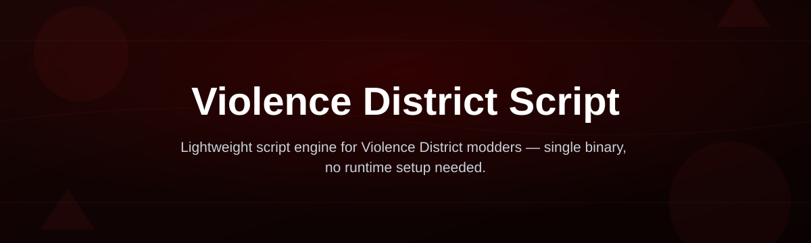
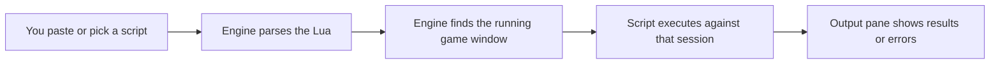

# violence-district-script-engine

*A standalone Windows companion for running custom Violence District scripts, built for players who just want their scripts loaded without fiddling with dev tools.*

## Quick start in 3 steps

If you already know what you're doing, here's the whole thing:

1. Open the landing page and download the current build for your Windows version.
2. Run the `.exe` — no installer, no admin toolchain, just a window that opens.
3. Load a script from the built-in list or paste your own, then hit run.

That's it. If you want the "why" behind each step, keep reading below.

## What this is

`violence-district-script-engine` is a lightweight Windows application built specifically for loading and running Lua-based scripts made for the game Violence District. Instead of juggling separate tools, a text editor, and a console window, this engine gives you one interface: paste or pick a script, press run, and watch the output. It doesn't modify the game files on disk — it works alongside the running game session, the same way a script console would.

The project exists because most script resources for Violence District are scattered across forums and Discord servers with no consistent way to actually run them. This engine standardizes that step. It ships as a single portable executable, keeps a small local script library so you're not re-downloading the same snippets every session, and stays out of the way otherwise — no background services, no telemetry dashboard, no forced updates you didn't ask for.

  

The button above opens the project's landing page, where the current Windows build is available to download.

## Who it is for

| Audience | Why they use it |
|---|---|
| Violence District players | Want scripts running without touching a raw Lua console |
| Server admins testing scripts | Need a quick way to verify a script before sharing it |
| Script authors | Use it as a lightweight runner while writing and debugging |
| Returning players in 2026 | Coming back after a break and want a current, working setup |

## What you can do

| Capability | What it means in practice |
|---|---|
| **Run local or pasted scripts** | Paste raw Lua directly into the panel, or point it at a `.lua` file on disk |
| **Keep a script library** | Save frequently used scripts locally so they persist between sessions |
| **Read live console output** | See print statements and errors in a dedicated output pane, not a hidden log file |
| **Switch between script tabs** | Keep several scripts open at once instead of overwriting your editor |
| **Adjust the execution delay** | Control how the engine paces script calls if the game session is slow to respond |
| **Reload without restarting** | Re-run a script after editing it without closing and reopening the app |
| **Export your saved scripts** | Copy your library to a text file to back it up or share it |
| **Auto-detect the game window** | The engine checks whether Violence District is currently running before you hit execute |

## Getting started

1. Go to the landing page linked above — it always points to the current release.
2. Download the `.exe`. There's no installer package; it's a single portable file.
3. Move it somewhere you'll remember (a dedicated folder is cleanest) and double-click to launch.
4. With Violence District open, paste a script or open one from the library panel.
5. Press **Run** and watch the output pane for confirmation or errors.

## Requirements

You need Windows 10 or 11 (64-bit) and nothing else. There's no separate runtime to install, no compiler, no package manager, and no toolchain setup — the executable is self-contained. Violence District itself should already be installed and running before you try to execute a script.

## How it works

At a high level, the engine sits between you and the game session as a script runner:

1. You provide a script, either typed directly or loaded from the local library.
2. The engine checks the syntax before attempting anything else.
3. It confirms Violence District is currently open on your machine.
4. The script runs, and any print output or errors stream into the console pane in real time.
5. If it fails, the error message tells you which line caused the problem instead of just crashing silently.

## Common Pitfalls

**"I downloaded it but Windows won't open the file."** This is usually SmartScreen flagging an unsigned executable, not a broken download. Click "More info" then "Run anyway" if you trust the source, or check your download folder for a blocked-file warning in the file properties.

**"My script runs but nothing happens in-game."** Make sure Violence District is actually open and loaded into the world before you press Run — the engine checks for the window, but it can't detect a game that's still on a loading screen.

**"The console just shows a red error and stops."** Read the line number in the error. Most of these are simple typos or a missing `end` in the Lua script itself, not an engine problem.

**"Is this the same as a script for a different Roblox game?"** No — this build is written specifically around Violence District's script environment. Scripts made for other games generally won't run correctly here.

**"Do I need to reinstall it after every game update?"** Not usually. The engine and the game update independently; you'll only need a new build if Violence District changes something the engine relies on to detect the session.

## Troubleshooting

**App opens then closes immediately.** Delete any old version from the same folder first — leftover config files from a previous build can conflict with a new one.

**Script library is empty after reopening.** Check that the app has write permission in the folder you placed it in; some restricted folders (like Program Files) block it from saving your local library.

**Output pane is frozen or blank.** Try reducing the execution delay setting mentioned earlier — a very low delay on a slow connection can make the console appear stuck when it's still catching up.

**Nothing happens when I click Run.** Confirm the script tab you're viewing is the one that's actually selected — clicking Run always executes the active tab, not the last one you edited.

## License

This project is released under the [MIT License](LICENSE). It is provided as-is, without warranty, and you're responsible for how you use it in relation to Violence District's own terms of service.

  

